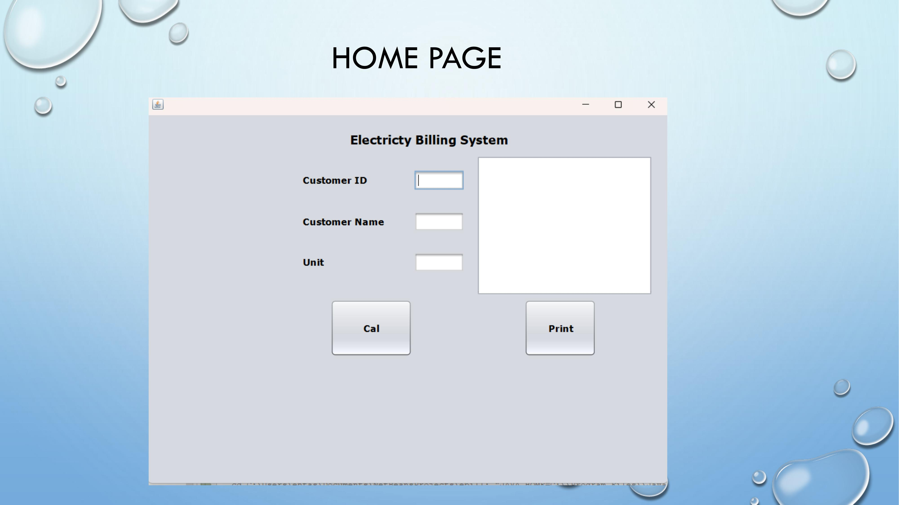

# ElectrictyBillingSystem

  

<h3 align="center">Electricty Billing System</h3>

   
  
  
  

---

 We can Generate Electricity Bill According To Power Consumed and Charges
      

## 📝 Table of Contents
- [About](#about)
- [Getting Started](#getting_started)
- [Built Using](#built_using)
- [Screenshots](#screenshots)
- [Authors](#authors)
- [Acknowledgments](#acknowledgement)

## 🧐 About 
Electricity Billing System is a software-based application developed in Java programming language. 
The main objective is to Get the details of Electricity Bill.

## 🏁 Getting Started 
Quick Bill generation according to power consumed and charges.

## ⛏️ Built Using 
- [Java](https://www.java.com/en/) - Environment
- [MySQL](https://www.mysql.com/) - Server Framework

## Screenshots

## ✍️ Authors 
- [@ehtashamathar](https://github.com/ehtashamathar) - Idea & Initial work

## 🎉 Acknowledgements 
- Bhupendra Parihar
- Junie Dunie Solomon

